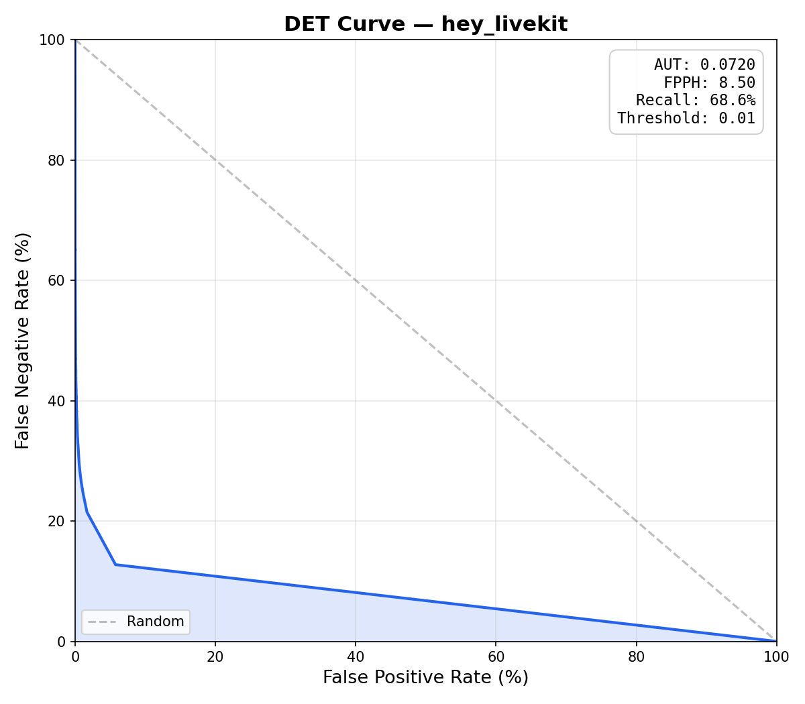
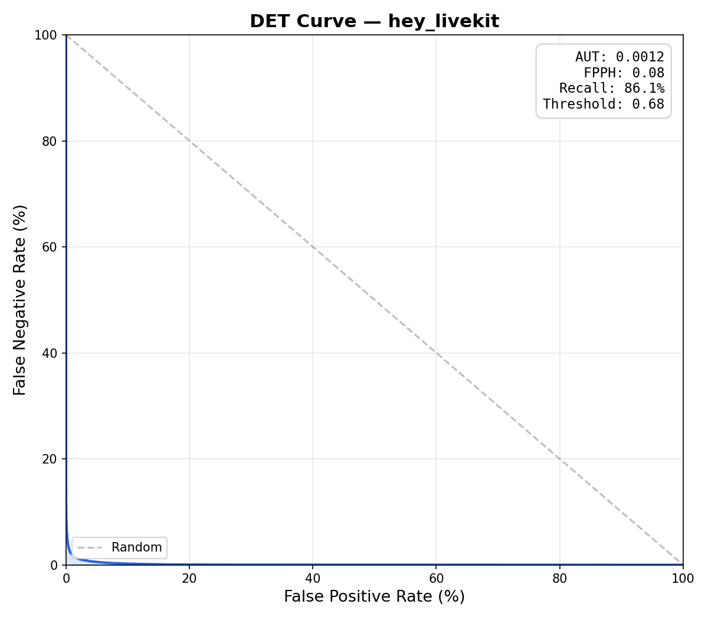

<a href="https://livekit.io/">
  
</a>

# livekit-wakeword

[](https://github.com/livekit/livekit-wakeword/actions/workflows/ci.yml)
[](https://www.python.org/downloads/)
[](LICENSE)
[](https://github.com/livekit/livekit-wakeword)

An open-source wake word library for creating voice-enabled applications. Based on [openWakeWord](https://github.com/dscripka/openWakeWord) with streamlined training — generate synthetic data, augment, train, and export from a single YAML config.

**Features:**

- **Conv-Attention classifier** — 1D temporal convolutions + multi-head self-attention replace openWakeWord's flat DNN head, preserving temporal structure across the 16-frame embedding window for better accuracy and fewer false positives (see [comparison](#openwakeword-vs-livekit-wakeword) below)
- **Backward compatible** with openWakeWord models and library
- **Train anywhere** — local machine, cloud, or spawn [SkyPilot](https://github.com/skypilot-org/skypilot) jobs
- **Zero dependency headaches** — uv handles everything

**Quick Links:**

- [Using Existing Models](#using-existing-models-and-library)
- [Training New Models Using The CLI](#training-new-models-using-the-cli)
- [Training New Models Using The Python API](#training-new-models-using-the-python-api)
- [openWakeWord vs livekit-wakeword](#openwakeword-vs-livekit-wakeword)

## Quick Start

### Using Existing Models and Library

**System dependencies (for microphone listener):**

```bash
# macOS
brew install portaudio

# Ubuntu/Debian
sudo apt install portaudio19-dev
```

**Installation:**

```bash
pip install git+https://github.com/livekit/livekit-wakeword.git
# or
uv add git+https://github.com/livekit/livekit-wakeword
```

**Basic inference:**

```python
from livekit.wakeword import WakeWordModel

model = WakeWordModel(models=["hey_livekit.onnx"])

# Feed audio frames (16kHz, int16 or float32)
scores = model.predict(audio_frame)
if scores["hey_livekit"] > 0.5:
    print("Wake word detected!")
```

**Async listener with microphone:**

```python
import asyncio
from livekit.wakeword import WakeWordModel, WakeWordListener

model = WakeWordModel(models=["hey_livekit.onnx"])

async def main():
    async with WakeWordListener(model, threshold=0.5, debounce=2.0) as listener:
        while True:
            detection = await listener.wait_for_detection()
            print(f"Detected {detection.name}! ({detection.confidence:.2f})")

asyncio.run(main())
```

### Training New Models Using The CLI

**System dependencies:**

```bash
# macOS
brew install espeak-ng ffmpeg portaudio

# Ubuntu/Debian
sudo apt install espeak-ng libsndfile1 ffmpeg sox portaudio19-dev
```

**Installation:**

```bash
# Install uv (if you don't have it)
curl -LsSf https://astral.sh/uv/install.sh | sh

# Clone and install
git clone https://github.com/livekit/livekit-wakeword
cd livekit-wakeword
uv sync --all-extras
```

**Download models and data:**

```bash
uv run livekit-wakeword setup
```

**Train a wake word:**

```bash
uv run livekit-wakeword run configs/hey_livekit.yaml
```

Or run stages individually:

```bash
uv run livekit-wakeword generate configs/hey_livekit.yaml  # TTS synthesis + adversarial negatives
uv run livekit-wakeword augment configs/hey_livekit.yaml   # Augment + extract features
uv run livekit-wakeword train configs/hey_livekit.yaml     # 3-phase adaptive training
uv run livekit-wakeword export configs/hey_livekit.yaml    # Export to ONNX
uv run livekit-wakeword eval configs/hey_livekit.yaml      # Evaluate model (DET curve, AUT, FPPH)
```

You can also evaluate any compatible ONNX model (e.g., one trained with openWakeWord):

```bash
uv run livekit-wakeword eval configs/hey_livekit.yaml -m /path/to/other_model.onnx
```

Eval produces a DET curve plot and metrics JSON in the output directory. See [Evaluation](docs/evaluation.md) for details.

**Config:**

See [configs/hey_livekit.yaml](configs/hey_livekit.yaml) for all options.

```yaml
model_name: hey_livekit
target_phrases:
  - "hey livekit"

n_samples: 10000 # training samples per class
model:
  model_type: conv_attention # conv_attention, dnn, or rnn
  model_size: small # tiny, small, medium, large
steps: 50000
target_fp_per_hour: 0.2
```

**Train on cloud GPUs with SkyPilot:**

See [skypilot/train.yaml](skypilot/train.yaml) for SkyPilot's example training job on Nebius.

```bash
sky launch skypilot/train.yaml
```

### Training New Models Using The Python API

The full training pipeline is available as a Python API, so you can import and drive it from your own code instead of using the CLI:

```python
from livekit.wakeword import (
    WakeWordConfig,
    load_config,
    run_generate,
    run_augment,
    run_extraction,
    run_train,
    run_export,
    run_eval,
)

# Load from YAML or construct directly
config = load_config("configs/hey_livekit.yaml")

# Or build a config programmatically
config = WakeWordConfig(
    model_name="hey_robot",
    target_phrases=["hey robot"],
    n_samples=5000,
    steps=30000,
)

# Run individual stages
run_generate(config)     # TTS synthesis + adversarial negatives
run_augment(config)      # Add noise, reverb, pitch shifts
run_extraction(config)   # Extract mel spectrograms + speech embeddings → .npy
run_train(config)        # 3-phase adaptive training
onnx_path = run_export(config)       # Export to ONNX

# Evaluate the exported model
results = run_eval(config, onnx_path)
print(f"AUT={results['aut']:.4f}  FPPH={results['fpph']:.2f}  Recall={results['recall']:.1%}")
```

This is useful for integrating wake word training into larger pipelines, automating model iteration, or building custom tooling on top of the data generation and training stages.

## openWakeWord vs livekit-wakeword

Both libraries share the same audio front-end: mel spectrograms are fed through frozen [Google speech embedding](https://github.com/google-research/google-research/tree/master/embedding_fns) and [openWakeWord embedding](https://github.com/dscripka/openWakeWord) models to produce a `(16, 96)` feature matrix (16 timesteps × 96-dim embeddings). The difference is the classification head that sits on top.

### Architecture

**openWakeWord** flattens the `(16, 96)` matrix into a 1536-d vector and feeds it through a small fully-connected DNN:

```
Flatten(16×96=1536) → Dense → Dense → Sigmoid
```

While the positional information is technically still present in the flattened vector, the dense layer has no inductive bias for temporal structure and must learn any sequential patterns from scratch.

**livekit-wakeword** introduces a **Conv-Attention** (`conv_attention`) classifier:

```
Conv1D blocks → MultiheadAttention → Mean pool → Linear(1) → Sigmoid
```

1. **1D Convolutions** (kernel size 3) slide across the 16 timesteps, capturing local temporal patterns (e.g., syllable transitions).
2. **Multi-Head Self-Attention** models long-range dependencies across the full temporal window, letting the model learn which timestep relationships matter.
3. **Mean pooling** aggregates attended features into a fixed-size vector for the final sigmoid output.

### Results

Both models were evaluated on the same validation set (15,000 positive clips, 45,084 negative clips, 25 hours of audio) using the "hey livekit" wake word. The livekit-wakeword model uses `conv_attention` (medium) trained with the [prod config](configs/prod.yaml).

| Metric | openWakeWord | livekit-wakeword |
|--------|:---:|:---:|
| **AUT*** | 0.0720 | **0.0012** |
| **FPPH*** | 8.50 | **0.08** |
| **Recall*** | 68.6% | **86.1%** |
| Optimal Threshold* | 0.01 | 0.68 |
| Accuracy | 84.0% | 93.1% |

<table>
<tr>
<td align="center"><strong>openWakeWord</strong></td>
<td align="center"><strong>livekit-wakeword</strong></td>
</tr>
<tr>
<td></td>
<td></td>
</tr>
</table>

The conv-attention head achieves **60x lower AUT** and **100x fewer false positives per hour** while detecting 17% more wake words. The DET curve (lower-left is better) shows near-perfect separation for livekit-wakeword, while the openWakeWord DNN struggles to distinguish positive and negative examples at any operating point.

*\***AUT** (Area Under the DET curve) — summarizes the full DET (Detection Error Tradeoff) curve, which plots false positive rate vs false negative rate across all thresholds. Lower is better (0 = perfect). A DET curve that hugs the bottom-left corner indicates strong separation between wake words and non-wake-words.*

*\***FPPH** (False Positives Per Hour) — how many times the model falsely triggers per hour of non-wake-word audio. Lower is better. For production use, < 0.5 FPPH is typical.*

*\***Recall** — the percentage of actual wake words correctly detected. Higher is better.*

*\***Optimal Threshold** — the detection threshold that maximizes recall while keeping FPPH at or below the target (configurable, default 0.1). The openWakeWord model's threshold of 0.01 indicates no threshold could meet the FPPH target — the evaluator fell back to the highest balanced accuracy. In contrast, livekit-wakeword finds a clean operating point at 0.68.*

### Why the difference?

- **Temporal awareness** — the conv-attention model sees the *order* of speech events, not just their presence, reducing false triggers from phonetically similar but differently ordered phrases.
- **Better accuracy at the same model size** — attention lets a small model selectively focus on discriminative time regions rather than learning dense connections over the full flattened input.
- **Lower false-positive rates** — temporal structure helps reject partial or reordered matches that a flat DNN would accept.

The conv-attention head is the default. You can switch to the original DNN or an RNN head via `model_type` in your config:

```yaml
model:
  model_type: conv_attention  # conv_attention (default) | dnn | rnn
  model_size: small           # tiny, small, medium, large
```

## Detailed Documentation

If you want to understand more about how this library works:

- [Architecture Overview](docs/overview.md) — system design and data flow
- [Data Generation](docs/data-generation.md) — TTS synthesis and adversarial negatives
- [Augmentation](docs/augmentation.md) — audio transforms and alignment
- [Feature Extraction](docs/feature-extraction.md) — mel spectrograms and embeddings
- [Training](docs/training.md) — 3-phase training and checkpoint averaging
- [Export & Inference](docs/export-and-inference.md) — ONNX export and Python API
- [Evaluation](docs/evaluation.md) — DET curves, AUT, and model comparison

## License

This project is licensed under the Apache License 2.0 — see the [LICENSE](LICENSE) file for details.
